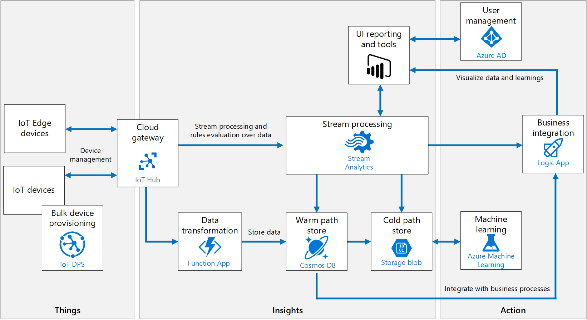
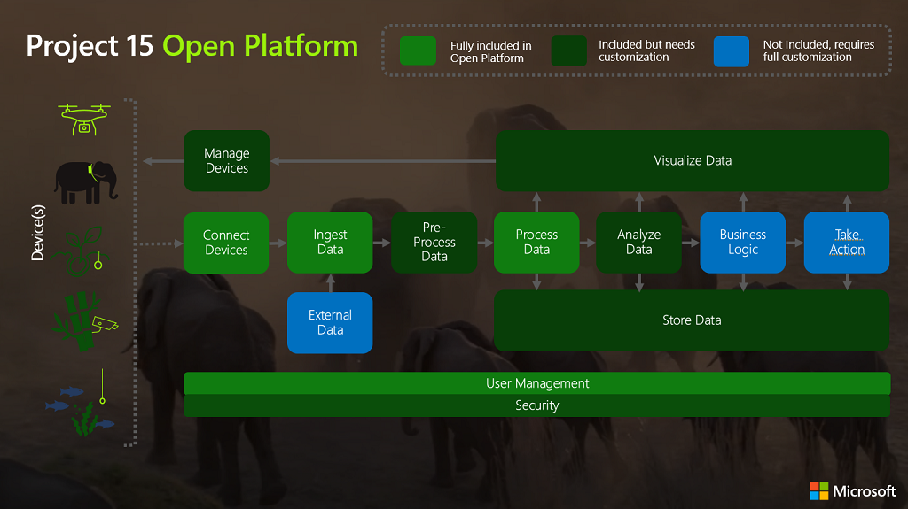
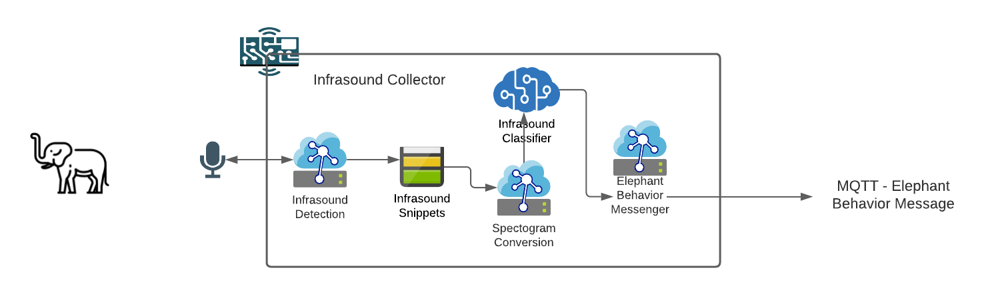
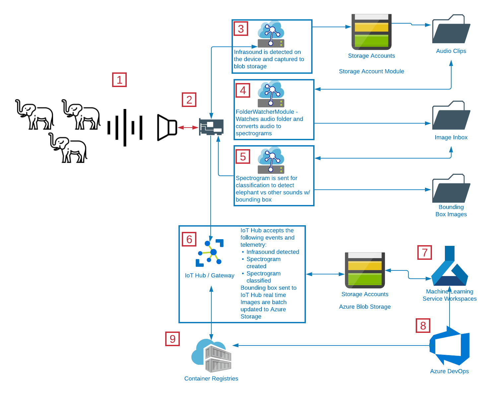
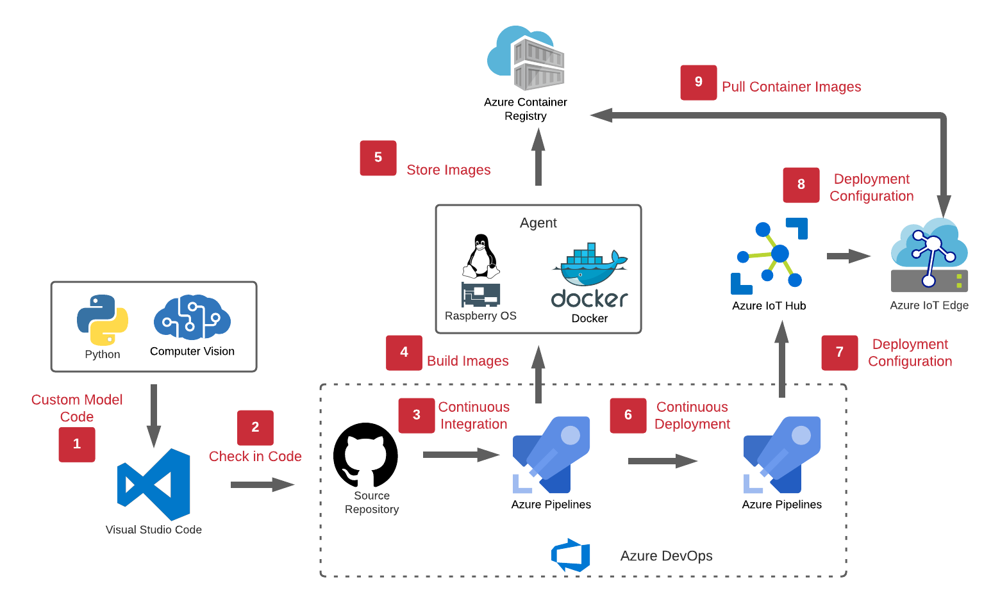

# An Elephant Infrasound Detection IoT Device and the Data Analysis System to Build Elephant Behavioral Detection

## Oxford Group 2 Project 15 (AI for Good) Presentation Repository

Authors:

*Aneeq Rehman, Dnyaneshwar Kulkarni, Giulia Ciardi, Tommaso Pappagallo, Vivek
Shaw, Shawn Deggans*

## (Objectives) Can We Use IoT and Machine Learning to Save Elephant Lives?

The goal of this project is to create a platform that will allow researchers to
continuously build and refine machine learning models that recognize elephant
behavior from infrasound. This platform is based on Microsoft's Project15
architecture with modifications to meet the stated goal of the system. This
document will explore the problem area we are attempting to address and the
system design we think will best address the needs of that problem area.

Our recommended system is evolutionary and allows researchers to use the modern
Agile development practices of empiricists decision-making, continuous
iteration, and continuous delivery to bring the behavioral categorization models
closer to the elephants in the field. It is the hope of this project's
participants that these models and the system designed to build these models
will help save the lives of elephants from human influenced threats.

## (Background) Human Influenced Threats and the Plight of Elephants

> "We lose one elephants from the planet every fifteen minutes," says Sarah M.
> W. Maston, IoT Solutions Architect. "We will lose all elephants in ten
> years."

Elephant populations are in decline[^1].

In a single decade between 1979 and 1989, half of all Africa's elephants were
lost to the ivory trade, according to pan African census conducted by STE (Save
the Elephants) lain Douglas-Hamilton. In response to this decline, CITES (the
Convention on International Trade in Endangered Species of Wild Fauna and Flora)
banned international trade of elephant ivory[^2]. This ban provided a temporary
reprieve from the population decline of elephants until demand for ivory came
from the new wealth of China and other wealthy nations. The continued demand for
ivory is one of the primary factors that contributes to the decline of the
elephants' population[^3].

However, the demand for ivory aren't the only challenges to elephant
populations. According to [elephantvoices.org](http://elephantvoices.org), the
survival and wellbeing of elephants are threatened by:

- Escalating poaching, or illegal killing, for the commercial trade in ivory
    and meat.

- Growing demands of exploding human populations and poverty.

- Increasing loss and fragmentation of natural habitats and lack of land-use
    planning.

- Rising conflict with humans over diminishing resources[^4].

In the book, *Monitoring Elephant Population and Assessing Threats a manual for
researchers, managers, and conservationists,* author Simon Hedges states,
"Elephants still occur in isolated populations across much of their historical
range, but unfortunately their numbers are rapidly declining. The major threats
to the continued survival of these species in many places are habitat loss,
degradation, and fragmentation, as well as poaching for ivory and other forms of
illegal killing or capture—usually because of conflicts with humans. Effective
monitoring programs, which involve systematic collection of data on the
distribution, size and trend of elephant populations, as well as threats such as
illegal killing, are needed to provide a rational basis for the management of
elephant populations[^5].

Microsoft's Project15 is an open-source solution platform built to aid
conservation projects using IoT. We aim to apply this technology stack to the
tracking and understanding of elephant behavior to contribute to an effective
monitoring program. We believe our solution will help do the following:

- Systematically collect data related to elephant vocalization.

- Detect threats based on elephant behavior.

Focusing specifically on recognizing elephant vocalization using infrasound
telemetry, we will demonstrate how a research team could utilize machine
learning to improve our understanding of elephant communication in relation to
their environment.

## (Assumptions) Building on What We Know and Understand

We know quite a lot about elephant behavior and communication. Elephants have
demonstrated insight and complex problem-solving skills, as demonstrated in the
video below.

> "Insightful Problem Solving in an Asian Elephant. Kandula, an 8-year old
> Asian elephant at the Smithsonian's National Zoo, demonstrates insightful
> problem solving by positioning a large cube under a treat that is too high
> for him to reach. By standing on the cube he can reach the food. He was not
> trained to do this and came up with this solution on his own. From the
> scientific paper "Insightful Problem Solving in an Asian Elephant,"
> published Aug. 18, 2011 in the journal PLoS ONE."

[Kandula, National Zoo, insightful problem solving 2 YouTube Video](https://youtu.be/u5sFxcxoy3Q)

Elephants show complex social skills and behavior*.* They show
self-recognition[^6]. They demonstrate an evolving pattern of behaviors when
faced with complex problems[^7].

The research shows that elephants are complex, intelligent animals with a rich
social familial structure. It's our assumption that these behaviors are a
valuable tool in the struggle to save elephants lives. To accomplish our goal of
building a system that focuses on this particular aspect of elephant life and
behaviors, we turned to existing research and projects that focused on
infrasound and elephants. A primary source for research is [The Cornell Lab
Elephant Listening Project.](https://elephantlisteningproject.org/)

The Elephant Listening Project is built on the work carried out by Katy Payne, a
zoologist and researcher who first used infrasound to listen in on the
conversations of some of Earth's largest mammals, like whales and elephants[^8].

We are focusing on infrasound, because like Katy Payne we hope to not only build
a greater understanding of elephant conversations, but the behavior that goes
with those conversations.

## Infrasound

[Infrasound YouTube Video](https://youtu.be/5pY2UxJa0ps "Infrasound")

~   Infrasound

It's important to understand that the elephant's vocalization is produced using
its complex larynx. Elephants' low-frequency vocalizations are produced by
flow-induced self-sustaining oscillations of laryngeal tissue[^9]. This unique
anatomy allows elephants to communicate in a sonic range that is below our
hearing (14-24hz). This means that a standard microphone will not be an adequate
detector for elephant vocalization. The normal range for standard microphones is
20hz-20khz. Specialized microphones can capture sound in the range of 1hz and
above. Acquiring these specialized microphones and infrasound detection tools
are beyond the scope of this project, in our approach we will outline how such a
tool could be created and used in the field by rangers and researchers.

As we explored infrasound, we learned that many sounds in the forest were in the
infrasound range. One of the challenges of capturing elephant communication was
learning to recognize it among the many other sounds of the forest.

To narrow down the elephant sounds, it's important to understand how they
communicate and the differences between male vocalizations and female
vocalizations.

Elephants produce a wide range of sounds from very low frequency rumbles to
higher frequency snorts, barks, roars, cries, and other idiosyncratic
calls[^10].

Because there is already research around call types
(<https://www.nationalgeographic.com/animals/article/what-elephant-calls-mean>)
we can start with this as the basis of our models.

With an understanding of these communication details, and evidence that suggests
elephants might have a specific way of addressing threats, we believe that using
these vocalization patterns will allow us to recognize the specific rumbles of
elephants and separate them from other low frequency noise[^11].

Because so much research has been conducted in this area, we believe this is a
good area to focus our value creation efforts. We believe a system that allows
for the collection of infrasound, the separation of elephant vocalizations from
other low frequency noise, and categorization based on continuous machine
learning, all built on Microsoft's Project15 open-sourced infrastructure using
Azure DevOps for CI/CD will provide researchers, rangers, and conservationists a
platform to allow for better elephant behavior understanding.

## Our Proposed Methodology for Achieving an Elephant Behavior Detection System

Our system is designed based on the patterns Microsoft has introduced in its
Azure IoT Suite of tools and services. The basic structure of that architecture
is divided into three primary areas of focus:

- Things

- Insights

- Action

Figure - Azure IoT Reference Architecture

Comparing this architecture to the Project15 open-source platform for
conservation, we can see the overlap.

Figure - Project 15 Open Platform Architecture

We made a few early design decisions related to the devices (the things). We
wanted something less intrusive to the elephants than a collar or wearable. The
device we are proposing is one that managed in a grid configuration.

There are good arguments to be made for developing a device that the elephant
"wears." For instance, one of the easiest ways to detect the vocalizations of an
elephant would be to use a vibration sensor. This vibration sensor could be
built using piezoelectric ceramic to detect acoustic waves and worn on the
elephant's trunk. Special tracking collars are in use today, but this solution
seems intrusive to the animal and difficult to manage and maintain for the
limited rangers responsible for the well-being of the elephants. We wanted
something to capture a larger range.

## The Things – Infrasound Capture Devices

We are interested in exploring one type of infrasound capture device:

- Infrasound detection array

The infrastructure detection array is the capstone project of a Spring 2020
project by team members: James Berger, Tiffany Graham, Josh Wewerka, and Tyler
Wyse. Project details can be explored here,
"<https://engineering.ucdenver.edu/current-students/capstone-expo/archived-expos/spring-2020/electrical-engineering/elec6-improving-infrasound-detection>"

This project was designed to detect infrasound direction using an array of
infrasound microphones, but we would use the infrasound microphones in a
low-powered device that could communicate over a long-range radio network, such
as LoRaWAN. This network of devices would serve as the primary means for
tracking elephants and recording their vocalization.

We envision this device as an IoT Edge device capable of supporting Azure
Storage Account Blob Storage and custom IoT Edge Modules that are containerized
machine learning modules capable to converting audio into spectrograms, and
spectrograms into bounding box marked images, and delivering telemetry to IoT
Hub.

This was our initial device design:

Figure - Group 2 Original Infrasound Capture Concept

As we completed the proof-of-concept code for this project, we came up with this
more detailed diagram based on our known logic flow:

Figure - Our Matured Infrasound Detection IoT Edge Device

The above follows the overall proposed flow of the device-to-cloud
communication, as well as the IoT Edge's internal device logic.

1. The infrasound capture device continuously monitors for infrasound. These
    infrasound signals are captured and sent to the device for analysis.

2. The 64 bit Raspberry Pi model captures the infrasound audio signals, breaks
    these into segments based on detected beginning-of-signal and end-of-signal
    indicators. Initially this limitation could mean we miss "conversations,"
    because this is the equivalent of capturing a word from each sentence in
    human speech. Elephants don't necessarily speak in words and sentences, so
    this likely won't keep us from meeting the goals of the system.

3. These audio files will be saved to an Azure blob storage device module in a
    audio clips file
    [<https://docs.microsoft.com/en-us/azure/iot-edge/how-to-store-data-blob?view=iotedge-2018-06>].

4. We'll use an Azure Function to serve as a file watcher for the file storage.
    When it detects the file is there, it will convert it to a spectrogram. [See
    spectrogram conversion process].[See Wren file watcher solution:
    <https://jaredrhodes.com/2017/11/27/create-azure-function-to-process-iot-hub-file-upload/>].
    When audio files are processed, they are converted to spectrograms. These
    spectrograms are saved to an image inbox.

5. A second function listens to the image inbox for new images. When new images
    appear, the function feeds the images to the classification model. The
    classification model returns the bounding box coordinates. We'll use CV2 to
    draw the coordinates on the image. Images are then saved to Bounding Box
    Images folder for more backend processing within Azure ML to help feed the
    ML loop.

The above covers the primary 'things' portion of the architecture. The next
section covers the insights portion of development where we capture what's
reported for telemetry to IoT hub and captured into the Azure Data Lake Gen 2.

## The Insights and Actions - Telemetry, Images, and Coordinate Data

Our backend IoT architecture is based on a few key functionalities needed to
meet the requirements of our minimal value product. There are a few things we've
left out of the typical Azure IoT Suite. We have not included the Device
Provisioning Service, because we do not anticipate deploying many devices. We
aren't including Logic Apps for business processing because we anticipate this
being a closed loop system. The Actions portion of the Things, Insights, Actions
formula will be handled using Azure ML, VS Code, and Storage Explorer for
management and administration.

1. IoT Hub is used as the primary IoT gateway. From here we manage device
    provisioning, IoT edge device creation, telemetry routing, and security. We
    will use the SAS token security and employ a regular SAS key rotation policy
    to keep devices secure. We will directly attach the [2] blob storage account
    to store images from the Azure IoT Blob Storage Module. Azure IoT accepts
    updated docker file images from the [9] Container Registry. Telemetry data
    is transferred to the [3] Stream Analytics Jobs.

2. Blob Storage holds images saved on the IoT Edge Module. This means that it
    also has folders that represent audio clips, image inbox, and bounding box
    images. This represents cold storage of data that could be studied later or
    needs to be archived.

3. Stream Analytics Jobs are used to query telemetry data and run business
    rules over streaming. We will use this to format our telemetry data and
    enrich it as needed. Data will be stored in the [4] Azure Data Lake Storage
    Gen 2.

4. Azure Data Lake Storage Gen 2. We will use a standard data engineering
    processing layers within the data lake that includes bronze, silver, and
    gold. Data coming directly from the [3] Stream Analytics Jobs will land
    directly in the bronze container within a date-time folder structure.

5. Azure ML is the primary workspace for testing and training machine learning
    models. We're anticipating two primary models. One built specifically for
    recognizing infrasound from audio files and another to specifically create
    bounding boxes around infrasound that best represent elephant vocalizations
    [Aneeq or Tommaso please correct this or clarify if wrong]. When models are
    complete, they are exported as containers and checked into [8] DevOps for
    the CI/CD process.

6. Visual Studio Code or Code is the primary tool for managing the IoT Edge
    module code logic related to working with device blob storage and data
    orchestration. Code from here is checked into [8] DevOps and is built out to
    the [9] Container Registry.

7. Storage Explorer is used to help manage data on the [2] Blob Storage and [4]
    Data Lake Storage Gen 2. This allows for testing, downloading, or moving
    data for an operations person.

8. Azure DevOps is one of the most important pieces of our MLOPs process. From
    here code is checked in and pushed out to the [9] Container Registry. There
    are two primary types of modules that can be created. There are code modules
    that represent the Azure Functions and ML model data orchestration. Then
    there are ML models. Model modules can be created from [5] Azure ML and
    checked in to be deployed to the [9] Container Registry. Basically, code is
    typically containerized in Azure DevOps for deployment to the [9] Container
    Registry and [1] IoT Hub is triggered to load the latest version of the
    latest docker file.

9. Container Registry is used to hold the Dockerfile images that represent the
    IoT Edge Modules. Modules are pulled by [1] IoT Hub to automatically deploy
    to devices in the field.

## Audio Processing, Imaging, and Categorizing Elephant Vocalizations

[Tomasso and Aneeq, this is the place to get into the details of the machine
learning and python libraries portions of this solution]

## Observations

1. Most of our initial observations were around the lack of labelling on the
    sound files we worked with. It took some effort to determine what were
    elephant sounds VS other possible infrasound files. To better recognize
    elephant vocalizations, creating a dataset of labeled data would help
    improve model training efforts related to recognizing elephant behavior.

2. After research, we understand that our approach of analyzing infrasound is a
    limited scope of the overall communication among elephants. The sounds are
    important, but like humans, elephants express their communication in more
    ways than just their voices. Elephants also express body language (visual
    communication), chemical communication, and tactile communication. We
    understand that this means the audio only component won't get the full
    picture, but we do hope that it will add Elephant Sound Database.

3. There are very few quality tools for capturing or measuring infrasound on
    the market. Most range from either very expensive scientifically exact
    measuring tools meant for detecting Earthquakes and nuclear tests or very
    cheap Do-it-yourself electronic hobbyist attempts, like the device we've
    proposed here. We did discover that there are mobile apps that could serve
    as a less expensive alternatives, but they require a solid internet
    connection either through WiFi or a 3-4G mobile connection. Considering
    these are in remote locations, we didn't think that would be a viable
    solution. What we have proposed doesn't quite exists yet, so there's
    opportunity to help by creating a very small, very low power device that
    could possible user either UHF band to communicate or LoRaWAN. It might also
    be possible to attach the detector to drones. The drones could fly to a
    location, land, and shut off, and then collect data. After collecting data
    they could power back up and fly to a point where they could deliver the
    data to a network. This was beyond the scope of our legwork for this
    project, but it does represent what's possible using an IoT Edge device that
    can work in an offline state.

4. There is a real conflict between humans invading elephant spaces and
    elephants invading human spaces. Elephants are the cause of lots of crop
    damage and farmer deaths in India. Technologies that make farmers aware of
    the elephants might be a good idea to help protect crops and human life.
    However, that technology could be used to endanger elephant lives. This is
    an interesting problem area that we didn't explore. Finding a solution in
    this area that considers the protection of human lives and property as well
    as the lives of elephants would be a problem worth solving.

## Analysis - A Demo of a Proof of Concept

Building the complete solution was outside the scope of time we had available. Therefore, we decided to provide a colleciton of technical proofs that we felt best represented the viability of this concept. Here were the primary areas where we want to build technical solutions to address specific problem areas.

Proof #1 - We could use DevOps to produce our IoT Suite of services and automatically push new IoT Edge modules to an IoT Edge device.

Our goal was to build a complete MLOPs pipeline, but we made a few early decisions that made that difficult. We trained and created some of our models in vendor locked systems. This limited our ability to create a fully functioning MLOPs process, but we were able to build a standard IoT Edge DevOps pipeline. This means that any custom modules checked in could be automatically deployed to the edge device. The following link will take you to a YouTube video explaining it.

[A YouTube video walkthrough of our DevOps process.](https://youtu.be/ykfQggAf-bY)

Proof #2 - We could build out the Azure services and infrastructure needed to support our ideas.

[A YouTube video walkthrough of our Azure infrastructure.](https://www.youtube.com/watch?v=GPtdcHC59w4)

Proof #3 - We could read sound files, convert those to spectrogramss, and use those spectrogramss to recognize elephant vocalization.

Proof #4 - We could produce the primary logic that represents the inner workings of the IoT Edge device. This means we could take the spectrogram image and categorize the elephant vocalizations using a machine learning model, mark that immage with a bounding box representing that vocalization, and send the data related to these findings to IoT Hub as telemetry.

[A YouTube video wlkthrough of our Boudning box and Prediction logic.](https://youtu.be/rAG93pHBB0Q)

## Discussions - Some of our Team's Thoughts on this Project

[Here we can put down some of our existing discussions from Teams]

## Conclusions and Moving Forward

There's a lot of opportunity for addressing this problem with technology. It's
our opinion that the solutions should be respectful of the elephants, their
environment, and their social structures. We've seen studies that require the
elephants in captivity, or required elephants to wear devices, or require
cumbersome devices in their environment.

We do understand that trade-offs are sometimes necessary to save their lives,
but we would like to secure the lives of the elephants in a way that is
respectful of their lives and environment. Meaning, if we can remain an
invisible observer that only intercedes to save lives from human encroachment,
that would be ideal.

We also understand that our offering is only a small piece of the larger set of
tools required to do an adequate job of saving elephant lives. Our solution is
modular and could easily integrate with other solutions like satellite imaging,
drone imaging, infrasound and other audio triangulation devices, thermal
scanners, and other telemetry gathering devices that can work seamlessly with
the environment.

Our hope would be that we can complete the development necessary to see a
working version of this system. We've tested many of the individual parts,
tested some of the integrations, but it's still not in a completed state. We
would like to build Infrastructure as Code versions of the Azure infrastructure,
check in all the IoT Edge code in Azure DevOps, and being developing our models
in Azure ML. Additionally, there are some tools that require professional
licenses to complete. We would need to either purchase those licenses or find
other libraries that offer similar or same functionality. The next step would be
developing the actual IoT Edge device and finally we would like to see that
device deployed and used by the researchers and rangers involved in the
protection of elephants.

___

### *Footnotes*

[^1]: Elephant statistics related to populations in decline,
"<https://www.savetheelephants.org/about-elephants-2-3-2/statistics/>"

[^2]: CITEs ban on elephant ivory trade,
"<https://cites.org/eng/news/Current_rules_commercial_international_trade_elephant_ivory_under_CITES_Proposals_CITES_CoP17_200716>"

[^3]: Who really buys elephant ivory?
"<https://www.nationalgeographic.com/pages/article/150812-elephant-ivory-demand-wildlife-trafficking-china-world>"

[^4]: What are the greatest threats to elephants?
"<https://www.elephantvoices.org/support-now/7-elephantvoices/support-now/52-main-threats-to-elephants.html>"

[^5]: Monitoring Elephant Populations and Assessing Threats a manual for
researchers, managers, and conservationists by Simon Hedges (Ed.)
<https://www.fws.gov/international/pdf/Monitoring_Elephant_Populations_and_Assessing_Threats_to_press_version.pdf>

[^6]: Elephant MSR (Mirror Self-recognition)
<https://www.pnas.org/content/103/45/17053?utm_source=TrendMD&utm_medium=cpc&utm_campaign=Proc_Natl_Acad_Sci_U_S_A_TrendMD_0>

[^7]: Elephant social skills and behavior
"<https://www.pnas.org/content/108/12/5116.short>"

[^8]: Katy Payne
"<https://www.nytimes.com/1993/11/09/science/scientist-at-work-katy-payne-picking-up-mammals-deep-notes.html>"

[^9]: Complex vibratory patterns in an elephant larynx
(<https://jeb.biologists.org/content/216/21/4054>)

[^10]: Elephant communication
(<https://www.elephantvoices.org/elephant-communication/acoustic-communication.html>)

[^11]: Do elephants make alarm call that means, "humans!"
(<https://earthsky.org/earth/do-elephants-make-alarm-call-that-means-humans>)